<p align="center">
  <h1 align="center">Caret</h1>
</p>

<p align="center">
  <b>The LLM dataset curation engine that makes Python tools obsolete.</b><br/>
  Zero-copy I/O. SIMD deduplication. 60fps TUI. Written in Rust.
</p>

<p align="center">
  
  
  
  
</p>

---

Open 50GB+ datasets **in 0.003 seconds**. Deduplicate 10M records **in seconds, not hours**. Visualize token boundaries with **Tiktoken cl100k_base**. Catch data quality issues **before they tank your $2,000 fine-tuning run**.

## Why Rust?

This isn't a rewrite-it-in-Rust meme. Caret uses Rust-specific capabilities that are **structurally impossible** in Python:

| Capability | Caret (Rust) | Python (pandas/datasets) | Why It Matters |
|---|---|---|---|
| **Open 50GB JSONL** | 0.003s (mmap, zero-copy) | 45-120s (full parse) | You don't wait. Ever. |
| **Line access** | O(1) byte-offset lookup | O(N) seek or full load | Scroll 100M lines at 60fps |
| **Dedup 1M records** | ~2s (SimHash + POPCNT) | ~90s (Python MinHash) | SIMD instructions, not GIL |
| **Memory for 50GB file** | ~0 bytes (OS page cache) | 50-100GB (DataFrame copy) | Your 16GB laptop works fine |
| **Tokenization cache** | Lock-free LRU, zero-copy | GIL-bound, alloc-heavy | Smooth scrolling, not jank |

The performance gap isn't 2x. It's **1,000-10,000x** for file open, and **10-50x** for compute-bound operations. This is what happens when your data never leaves kernel space.

## Features

### Zero-Copy Dataset Engine
Memory-mapped I/O via `memmap2`. The OS page cache becomes your DataFrame. Caret never copies your data — it slices directly into the memory-mapped region. Works with **JSONL, Parquet, and CSV**.

### SIMD-Accelerated Deduplication (NEW in v0.3)
Near-duplicate detection powered by SimHash fingerprinting with hardware-accelerated Hamming distance (`POPCNT`). Parallel fingerprinting via `rayon` reads directly from the mmap — zero copies, zero allocations.

```bash
# Headless dedup scan
caret data.jsonl --dedup

# Export deduplicated dataset
caret data.jsonl --dedup --dedup-export clean.jsonl

# Exact-match mode (strictest)
caret data.jsonl --dedup --dedup-strategy exact

# Aggressive fuzzy matching (threshold 0-10, default 3)
caret data.jsonl --dedup --dedup-threshold 5
```

Press `D` in the TUI to run an interactive dedup scan. Duplicate lines are highlighted in amber with a `DUP` badge.

### Token X-Ray Mode
Press `Tab` to see exactly how your text tokenizes. Uses **Tiktoken cl100k_base** (GPT-4) by default. Alternating background colors show token boundaries — finally understand why your model sees "un" + "related" instead of "unrelated".

### Reasoning Linter
Built for Chain-of-Thought datasets. Automatically detects:
- Unbalanced `<think>`/`</think>` tags
- Invalid JSON/JSONL structure
- Missing required keys
- Trailing whitespace corruption

### Auto-Fix Mode
```bash
caret data.jsonl --fix                    # Creates data_fixed.jsonl
caret data.jsonl --fix -o clean.jsonl     # Custom output path
caret data.jsonl --fix --fix-in-place     # Overwrite original (careful!)
```

### Detail Panel
Press `Enter` to open a split-screen view with pretty-printed JSON. Navigate deep nested structures without squinting at minified data.

### Pipeline Support
```bash
cat huge_dataset.jsonl | caret -
curl https://example.com/data.jsonl | caret -
```

## Zero-Copy Pipeline

```mermaid
graph LR
    A["Dataset File<br/>50GB+ JSONL"] -->|"mmap()"| B["Virtual Memory<br/>Zero-Copy"]
    B -->|"O(1) line index"| C["Byte Offset Table"]
    C -->|"get_line(n)"| D["&str slice<br/>No allocation"]
    D -->|"rayon par_iter"| E["SimHash Engine<br/>FNV-1a + POPCNT"]
    E -->|"sequential scan"| F["Dedup Index"]
    F -->|"POPCNT"| G["BitMask<br/>1B lines = 125MB"]

    style A fill:#ff6b6b,color:#fff
    style B fill:#4ecdc4,color:#fff
    style D fill:#45b7d1,color:#fff
    style E fill:#96ceb4,color:#fff
    style G fill:#ffeaa7,color:#333
```



**Key insight**: Your data never leaves kernel space. `mmap()` maps the file into virtual memory. The OS page cache handles I/O transparently. Caret's line index is just a `Vec<usize>` of byte offsets — O(1) access to any of billions of lines. When rayon's worker threads fingerprint lines for dedup, they read directly from the mmap'd region. No copies. No allocations. No GIL.

## Quick Start

```bash
# Install from source
git clone https://github.com/rayanouaddi/caret
cd caret
cargo build --release

# Open any dataset format
./target/release/caret data.jsonl          # JSONL (memory-mapped)
./target/release/caret data.parquet        # Parquet (Arrow-native)
./target/release/caret data.csv            # CSV (auto-converted)

# With Token X-Ray
./target/release/caret data.jsonl -t

# With linting
./target/release/caret data.jsonl --lint

# Deduplicate a dataset
./target/release/caret data.jsonl --dedup --dedup-export clean.jsonl
```

## Keyboard Shortcuts

| Key | Action |
|-----|--------|
| `j` / `Down` | Move down |
| `k` / `Up` | Move up |
| `g` | Go to top |
| `G` | Go to bottom |
| `Ctrl+d` | Page down |
| `Ctrl+u` | Page up |
| `Tab` | Cycle view: TEXT / TOKEN X-RAY / TREE |
| `Enter` | Toggle detail panel (pretty JSON) |
| `D` | Toggle dedup scan (SimHash) |
| `?` | Show help |
| `q` | Quit |

## Usage

```bash
# Basic usage (auto-detects format from extension)
caret data.jsonl
caret data.parquet
caret data.csv

# Force specific format
caret data.txt --format jsonl

# Linting
caret data.jsonl --lint
caret data.jsonl --lint --required-keys "messages,prompt"

# Token visualization
caret data.jsonl -t                                    # Tiktoken cl100k_base (default)
caret data.jsonl -t --tiktoken-encoding p50k_base      # Codex encoding
caret data.jsonl -t --tokenizer-type huggingface       # Llama 3.1
caret data.jsonl -t --tokenizer-type gpt2              # GPT-2 (legacy)
caret data.jsonl --tokenizer-path ./my-tokenizer.json  # Custom

# Deduplication
caret data.jsonl --dedup                               # Scan and report
caret data.jsonl --dedup --dedup-export clean.jsonl     # Export unique lines
caret data.jsonl --dedup --dedup-strategy exact         # Exact match only
caret data.jsonl --dedup --dedup-threshold 5            # Aggressive fuzzy

# Auto-fix
caret data.jsonl --fix                                 # data_fixed.jsonl
caret data.jsonl --fix -o output.jsonl                 # Custom output
caret data.jsonl --fix --fix-in-place                  # Overwrite (careful!)
caret data.jsonl --fix --skip-invalid                  # Skip unfixable lines

# Pipeline mode
cat data.jsonl | caret -
```

## Architecture

```
┌──────────────────────────────────────────────────────────┐
│                       Caret TUI (60fps)                  │
│                     Ratatui + Crossterm                   │
├──────────┬──────────┬──────────────────┬─────────────────┤
│ Dataset  │Tokenizer │     Linter       │  Dedup Engine   │
│  (mmap)  │(Tiktoken)│ (Regex + JSON)   │ (SimHash+rayon) │
├──────────┴──────────┴──────────────────┴─────────────────┤
│              memmap2 · serde_json · rayon                 │
└──────────────────────────────────────────────────────────┘
```

- **Memory Mapping**: Zero-copy file access via `memmap2` (JSONL)
- **Multi-Format**: Arrow-native Parquet, auto-converting CSV
- **Line Indexing**: O(1) access to any line via pre-computed byte offsets
- **Deduplication**: SimHash fingerprinting with POPCNT Hamming distance
- **Tokenization**: Tiktoken (cl100k_base) + HuggingFace tokenizers
- **Rendering**: Immediate-mode TUI with 60fps scrolling

## How the Dedup Engine Works

1. **Phase 1 — Parallel Fingerprinting**: `rayon` spawns worker threads that read lines directly from the memory-mapped file. Each line's string values are extracted via a zero-alloc JSON byte scanner (no `serde_json::Value` tree allocation). The extracted content is hashed into a 64-bit SimHash fingerprint using FNV-1a shingle hashing.

2. **Phase 2 — Index Construction**: Fingerprints are checked against an index of previously seen values. For `SimHash` mode, each comparison is a single `XOR` + `POPCNT` instruction pair (sub-nanosecond). Lines whose fingerprint is within the Hamming distance threshold of a previously seen fingerprint are flagged as duplicates in a compact `BitMask` (64 lines per `u64` word).

3. **Result**: A `BitMask` marking every duplicate line, plus a canonical map linking each duplicate to its first-seen original. The bitmask for 1 billion lines is only 125 MB.

## Contributing

Contributions welcome! Check out the issues labeled `good first issue`.

```bash
# Development
cargo run -- test_data.jsonl

# Run tests
cargo test

# Build optimized release (LTO + strip)
cargo build --release
```

## Requirements
- Rust 1.75+
- A terminal with 256-color support

## License

MIT License - see [LICENSE](LICENSE) for details.

---

<p align="center">
  Built with Rust for the LLM community.
</p>
