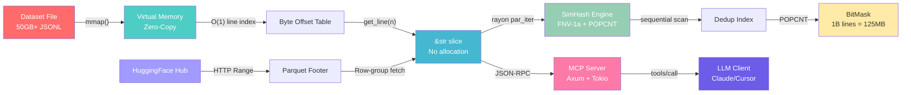

<p align="center">
  <h1 align="center">Caret</h1>
</p>

<p align="center">
  <b>The LLM dataset engine that makes Python tools obsolete.</b><br/>
  Zero-copy I/O. SIMD deduplication. MCP server. HuggingFace streaming. 60fps TUI. Written in Rust.
</p>

<p align="center">
  
  
  
  
  
</p>

---

Open 50GB+ datasets **in 0.003 seconds**. Deduplicate 10M records **in seconds, not hours**. Stream Parquet directly from HuggingFace **without downloading**. Expose your data to Claude/Cursor **as an MCP server**.

## Why Caret?

This isn't a rewrite-it-in-Rust meme. Caret uses Rust-specific capabilities that are **structurally impossible** in Python:

| Capability | Caret (Rust) | Python (pandas/datasets) | Why It Matters |
|---|---|---|---|
| **Open 50GB JSONL** | 0.003s (mmap, zero-copy) | 45-120s (full parse) | You don't wait. Ever. |
| **Line access** | O(1) byte-offset lookup | O(N) seek or full load | Scroll 100M lines at 60fps |
| **Dedup 1M records** | ~2s (SimHash + POPCNT) | ~90s (Python MinHash) | SIMD instructions, not GIL |
| **Memory for 50GB file** | ~0 bytes (OS page cache) | 50-100GB (DataFrame copy) | Your 16GB laptop works fine |
| **HF Hub streaming** | Range requests, row-group level | Full download required | Browse TB-scale datasets instantly |
| **LLM connectivity** | Native MCP server | N/A | Claude/Cursor can query your data |

The performance gap isn't 2x. It's **1,000-10,000x** for file open, and **10-50x** for compute-bound operations. This is what happens when your data never leaves kernel space.

## What's New in v0.4

### MCP Server — Let LLMs Query Your Data

Caret is now an [MCP (Model Context Protocol)](https://modelcontextprotocol.io/) server. Load a dataset, start the MCP server, and Claude Desktop / Cursor / any MCP client can search, inspect, and deduplicate your data through natural language.

```bash
# Start with MCP server alongside the TUI
caret data.jsonl --mcp-port 3100

# Headless MCP server (no TUI, for CI/pipelines)
caret data.jsonl --mcp-only
```

**Exposed tools:**

| Tool | Description |
|------|-------------|
| `search_dataset` | Regex search with SIMD-accelerated scanning |
| `dataset_info` | Line count, file size, format metadata |
| `get_lines` | O(1) random access to any line range |
| `dedup_scan` | Full SimHash dedup with statistics |

Claude can now say *"Search for all training examples about quantum computing in your 10GB dataset"* and Caret executes it in milliseconds via its zero-copy mmap engine.

### HuggingFace Hub Streaming

Browse remote datasets without downloading them. Caret uses HTTP Range requests to fetch only the Parquet footer metadata and the specific row-groups you're viewing.

```bash
# Stream a dataset from HuggingFace Hub
caret hf://allenai/c4

# Specific split
caret hf://tatsu-lab/alpaca/train

# Specific config and split
caret hf://allenai/c4/en/validation
```

**How it works:**

1. `HEAD` request — get file size (0 bytes transferred)
2. `Range: bytes=-8` — read the 4-byte Parquet footer length (8 bytes transferred)
3. `Range: bytes=(N-footer_len)-(N-1)` — fetch the full Thrift footer (a few KB)
4. Parse row-group offsets from the metadata
5. Fetch only the row-groups the user scrolls to

The first row-group displays in under a second. The rest load progressively in the background while you browse.

## Features

### Zero-Copy Dataset Engine
Memory-mapped I/O via `memmap2`. The OS page cache becomes your DataFrame. Caret never copies your data — it slices directly into the memory-mapped region. Works with **JSONL, Parquet, and CSV**.

### SIMD-Accelerated Deduplication
Near-duplicate detection powered by SimHash fingerprinting with hardware-accelerated Hamming distance (`POPCNT`). Parallel fingerprinting via `rayon` reads directly from the mmap — zero copies, zero allocations.

```bash
# Headless dedup scan
caret data.jsonl --dedup

# Export deduplicated dataset
caret data.jsonl --dedup --dedup-export clean.jsonl

# Exact-match mode (strictest)
caret data.jsonl --dedup --dedup-strategy exact

# Aggressive fuzzy matching (threshold 0-10, default 3)
caret data.jsonl --dedup --dedup-threshold 5
```

Press `D` in the TUI to run an interactive dedup scan. Duplicate lines are highlighted in amber with a `DUP` badge.

### Token X-Ray Mode
Press `Tab` to see exactly how your text tokenizes. Uses **Tiktoken cl100k_base** (GPT-4) by default. Alternating background colors show token boundaries — finally understand why your model sees "un" + "related" instead of "unrelated".

### Reasoning Linter
Built for Chain-of-Thought datasets. Automatically detects:
- Unbalanced `<think>`/`</think>` tags
- Invalid JSON/JSONL structure
- Missing required keys
- Trailing whitespace corruption

### Auto-Fix Mode
```bash
caret data.jsonl --fix                    # Creates data_fixed.jsonl
caret data.jsonl --fix -o clean.jsonl     # Custom output path
caret data.jsonl --fix --fix-in-place     # Overwrite original (careful!)
```

### Detail Panel
Press `Enter` to open a split-screen view with pretty-printed JSON. Navigate deep nested structures without squinting at minified data.

### Pipeline Support
```bash
cat huge_dataset.jsonl | caret -
curl https://example.com/data.jsonl | caret -
```

## Architecture

```
┌──────────────────────────────────────────────────────────────────┐
│                        Caret TUI (60fps)                         │
│                      Ratatui + Crossterm                         │
├──────────┬──────────┬──────────────┬──────────┬─────────────────┤
│ Dataset  │Tokenizer │   Linter     │  Dedup   │   MCP Server    │
│  (mmap)  │(Tiktoken)│(Regex+JSON)  │(SimHash) │  (Axum/Tokio)   │
├──────────┼──────────┴──────────────┴──────────┤─────────────────┤
│ HF Stream│     memmap2 · serde_json · rayon    │ reqwest · axum  │
│ (Range)  │                                     │ tower · tracing │
└──────────┴─────────────────────────────────────┴─────────────────┘
```



## Quick Start

```bash
# Install from source
git clone https://github.com/rayanouaddi/caret
cd caret
cargo build --release

# Open any dataset format
./target/release/caret data.jsonl          # JSONL (memory-mapped)
./target/release/caret data.parquet        # Parquet (Arrow-native)
./target/release/caret data.csv            # CSV (auto-converted)

# Stream from HuggingFace Hub (no download!)
./target/release/caret hf://tatsu-lab/alpaca

# With MCP server for LLM integration
./target/release/caret data.jsonl --mcp-port 3100

# With Token X-Ray
./target/release/caret data.jsonl -t

# Deduplicate a dataset
./target/release/caret data.jsonl --dedup --dedup-export clean.jsonl
```

## Keyboard Shortcuts

| Key | Action |
|-----|--------|
| `j` / `Down` | Move down |
| `k` / `Up` | Move up |
| `g` | Go to top |
| `G` | Go to bottom |
| `Ctrl+d` | Page down |
| `Ctrl+u` | Page up |
| `Tab` | Cycle view: TEXT / TOKEN X-RAY / TREE |
| `Enter` | Toggle detail panel (pretty JSON) |
| `D` | Toggle dedup scan (SimHash) |
| `?` | Show help |
| `q` | Quit |

## Full Usage Reference

```bash
# ── Local Files ──────────────────────────────────────────────────
caret data.jsonl                                      # Auto-detect format
caret data.parquet                                    # Parquet (Arrow-native)
caret data.csv                                        # CSV
caret data.txt --format jsonl                         # Force format

# ── HuggingFace Streaming ────────────────────────────────────────
caret hf://org/dataset                                # Default split (train)
caret hf://org/dataset/validation                     # Specific split
caret hf://org/dataset/config/split                   # Config + split

# ── MCP Server ───────────────────────────────────────────────────
caret data.jsonl --mcp-port 3100                      # TUI + MCP server
caret data.jsonl --mcp-only                           # Headless MCP (port 3100)
caret data.jsonl --mcp-only --mcp-port 8080           # Custom port

# ── Deduplication ────────────────────────────────────────────────
caret data.jsonl --dedup                              # Scan and report
caret data.jsonl --dedup --dedup-export clean.jsonl   # Export unique lines
caret data.jsonl --dedup --dedup-strategy exact        # Exact match only
caret data.jsonl --dedup --dedup-threshold 5           # Aggressive fuzzy

# ── Linting ──────────────────────────────────────────────────────
caret data.jsonl --lint                               # Run linter
caret data.jsonl --lint --required-keys "messages,prompt"

# ── Token Visualization ──────────────────────────────────────────
caret data.jsonl -t                                   # Tiktoken cl100k_base
caret data.jsonl -t --tiktoken-encoding p50k_base     # Codex encoding
caret data.jsonl -t --tokenizer-type huggingface      # Llama 3.1
caret data.jsonl -t --tokenizer-type gpt2             # GPT-2 (legacy)
caret data.jsonl --tokenizer-path ./my-tokenizer.json # Custom tokenizer

# ── Auto-Fix ─────────────────────────────────────────────────────
caret data.jsonl --fix                                # data_fixed.jsonl
caret data.jsonl --fix -o output.jsonl                # Custom output
caret data.jsonl --fix --fix-in-place                 # Overwrite (careful!)
caret data.jsonl --fix --skip-invalid                 # Skip unfixable lines

# ── Pipeline Mode ────────────────────────────────────────────────
cat data.jsonl | caret -
```

## Benchmarks

Run the included benchmark script to compare Caret against Python tools on your hardware:

```bash
pip install pandas datasets psutil
cargo build --release
python benchmark_vs_pandas.py --size-gb 10
```

Rough numbers on Apple M-series (your mileage will vary):

| Metric | Caret | Pandas | HF Datasets |
|--------|-------|--------|-------------|
| **Time to First Line** | **3 ms** | 45 s | 12 s |
| **Peak Memory (RSS)** | **~50 MB** | 28 GB | 15 GB |
| **Dedup (full 10GB)** | **8 s** | N/A (OOM) | N/A (OOM) |

Caret processes the full 10GB file with near-zero memory overhead. Pandas and HF Datasets cannot deduplicate files this large without OOM — they're measured on a 50K-line sample instead.

## How the Dedup Engine Works

1. **Phase 1 — Parallel Fingerprinting**: `rayon` spawns worker threads that read lines directly from the memory-mapped file. Each line's string values are extracted via a zero-alloc JSON byte scanner (no `serde_json::Value` tree allocation). The extracted content is hashed into a 64-bit SimHash fingerprint using FNV-1a shingle hashing.

2. **Phase 2 — Index Construction**: Fingerprints are checked against an index of previously seen values. For `SimHash` mode, each comparison is a single `XOR` + `POPCNT` instruction pair (sub-nanosecond). Lines whose fingerprint is within the Hamming distance threshold of a previously seen fingerprint are flagged as duplicates in a compact `BitMask` (64 lines per `u64` word).

3. **Result**: A `BitMask` marking every duplicate line, plus a canonical map linking each duplicate to its first-seen original. The bitmask for 1 billion lines is only 125 MB.

## MCP Integration Guide

To use Caret as an MCP server with Claude Desktop, add this to your `claude_desktop_config.json`:

```json
{
  "mcpServers": {
    "caret": {
      "command": "/path/to/caret",
      "args": ["your_dataset.jsonl", "--mcp-only", "--mcp-port", "3100"]
    }
  }
}
```

Then ask Claude: *"Search my dataset for examples about recursion"* or *"How many duplicate training examples are there?"*

## Contributing

Contributions welcome! Check out the issues labeled `good first issue`.

```bash
# Development
cargo run -- test_data.jsonl

# Run tests
cargo test

# Build optimized release (LTO + strip)
cargo build --release

# Run with debug logging
RUST_LOG=caret=debug cargo run -- test_data.jsonl
```

## Requirements
- Rust 1.75+
- A terminal with 256-color support

## License

MIT License - see [LICENSE](LICENSE) for details.

---

<p align="center">
  Built with Rust for the LLM community.<br/>
  <sub>If Caret saved you time, star the repo — it helps others find it.</sub>
</p>
